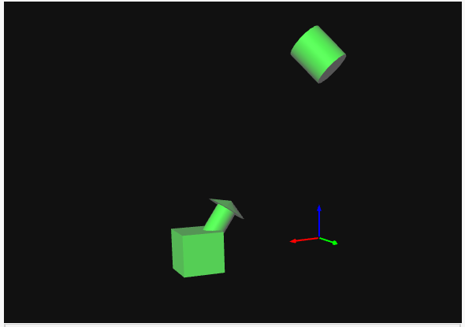

# CSMM.103x | Project 2

In this project we consider a ROS ecosystem, which consists of a robot with a camera mounted on it as well as an object. To describe the poses of all these items, we define the following coordinate frames:

- A base coordinate frame called '_base_'
- A robot coordinate frame  called '_robot_'
- A camera coordinate frame called '_camera_'
- An object coordinate frame '_object_'

The following relationships are true:

The transform from the '_base_' coordinate frame to the '_object_' coordinate frame consists of a rotation expressed as (roll, pitch, yaw) of (0.79, 0.0, 0.79) followed by a translation of 1.0 meter along the resulting y-axis and 1.0m along the resulting z-axis. 

The transform from the '_base_' coordinate frame to the '_robot_' coordinate frame consists of a rotation around the z-axis by 1.5 radians followed by a translation along the resulting y-axis of -1.0m. 

The transform from the '_robot_' coordinate frame to the '_camera_' coordinate frame must be defined as follows:
The translation component of this transform is (0.0, 0.1, 0.1)
The rotation component this transform must be set such that the camera is pointing directly at the object. In other words, the x-axis of the '_camera_' coordinate frame must be pointing directly at the origin of the '_object_' coordinate frame. 

Write a ROS node that publishes the following transforms to TF:

- The transform from the '_base_' coordinate frame to the '_object_' coordinate frame 
- The transform from the '_base_' coordinate frame to the '_robot_' coordinate frame 
- The transform from the '_robot_' coordinate frame to the '_camera_' coordinate frame

## Additional Information

For a rotation expressed as roll-pitch-yaw, you can use the `quaternion_from_euler()` or `euler_matrix()` functions with the default axes convention - i.e. `quaternion_from_euler(roll_value, pitch_value, yaw_value)`.

**Be careful about the order of operations**. If a transform specifies that the rotation must happen first, followed by the translation (e.g. at points 1. and 2. above), make sure to follow that.

The transforms must be published in a continuous loop at a rate of 10Hz or more.

Once you run your code, these bodies will position themselves in space according to the transforms your code is publishing. The cylinder denotes the object, the cube and arrow the robot and camera respectively. If your code works correctly, you should see the arrow point out of the cube directly at the cylinder. Here is an example of the correct output (note that the colored axes show you the location of the base coordinate frame with the usual convention: x-red, y-green, z-blue):

